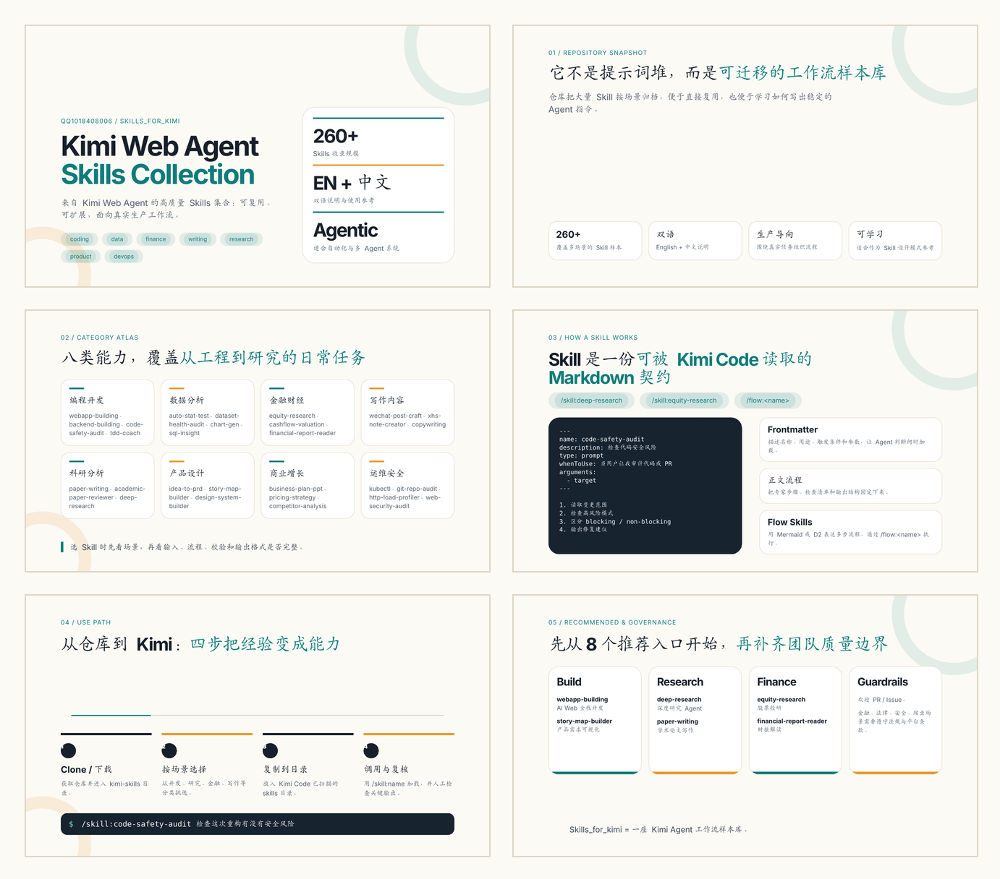

# Kimi Web Agent Skills Collection

<p align="center">
  
</p>

[English](./README.md)|[中文说明]

Kimi Web Agent中包含的高质量 Skill 。

本仓库收录了大量可复用、可扩展、适用于生产环境的 Skills，覆盖编程开发、数据分析、金融财经、内容写作、科研辅助、产品设计、运维安全、自动化工作流等多个方向。

## ✨ 特性

- 收录 260+ Skills
- 中英双语
- 面向真实工作流
- 支持 Agentic Workflow
- 分类清晰
- 适合作为 Skill 设计参考
- 适用于 AI 自动化与多 Agent 系统

---

# 📚 分类

## 💻 编程开发

面向 Coding Agent 与软件工程工作流。

代表 Skills：

- `webapp-building`
- `backend-building`
- `code-safety-audit`
- `tdd-coach`
- `playwright-scraper-skill`
- `rust-browser-pilot`

---

## 📊 数据分析

统计分析、数据可视化、SQL 与数据质量审计。

代表 Skills：

- `auto-stat-test`
- `regression-insight`
- `dataset-health-audit`
- `chart-gen`
- `sql-insight`

---

## 💹 金融财经

机构级金融研究与量化分析。

代表 Skills：

- `equity-research`
- `cashflow-valuation`
- `trading-strategy-backtest`
- `financial-report-reader`
- `stock-tech-analysis`

---

## ✍️ 写作内容

博客、自媒体、SEO、营销文案与内容创作。

代表 Skills：

- `wechat-post-craft`
- `xhs-note-creator`
- `zhihu-viral-answer`
- `copywriting`
- `podcast-blueprint`
- `professional-email-composer`

---

## 🔬 科研分析

学术写作、同行评审、Deep Research 与科研工作流。

代表 Skills：

- `paper-writing`
- `research-advisor`
- `academic-paper-reviewer`
- `deep-research`
- `scientific-problem-selection`

---

## 🎨 产品设计

产品经理与 UI/UX 工作流。

代表 Skills：

- `idea-to-prd`
- `story-map-builder`
- `design-system-builder`
- `landing-page-scaffold`

---

## 📈 商业计划

商业分析、定价策略、增长与竞品分析。

代表 Skills：

- `business-plan-ppt`
- `pricing-strategy`
- `competitor-analysis`
- `split-test-evaluator`

---

## 🛠 运维与安全

基础设施、Kubernetes、Terraform、安全审计与运维。

代表 Skills：

- `kubectl`
- `git-repo-audit`
- `http-load-profiler`
- `web-security-audit`

---

# 🚀 使用方式

将对应 Skill 放入 Agent 的 skills 目录即可使用。

示例：

```bash
skills/
├── webapp-building/
├── equity-research/
├── paper-writing/
└── ...
```

---

# 📦 仓库结构

```text
skills/
├── programming
├── data-analysis
├── finance
├── writing
├── research
├── product-design
├── project-management
├── devops-security
└── ...
```

---

# 🔥 推荐 Skills

| Skill                      | 用途          |
| -------------------------- | ----------- |
| `webapp-building`          | AI Web 全栈开发 |
| `deep-research`            | 深度研究 Agent  |
| `paper-writing`            | 学术论文写作      |
| `equity-research`          | 股票投研        |
| `xhs-note-creator`         | 小红书内容生成     |
| `code-safety-audit`        | 安全漏洞扫描      |
| `story-map-builder`        | 产品需求可视化     |
| `playwright-scraper-skill` | 智能网页爬取      |

---

# 🤝 贡献

欢迎提交：

- 新 Skills

- Prompt 优化

- 工作流改进

- 文档补充

- Bug 修复

欢迎 PR / Issue / Discussion。

---

# ⚠️ 免责声明

本仓库仅供学习与研究使用。

部分 Skills 涉及：

- 金融分析

- 法律文书

- 自动化爬取

- 安全审计

请遵守当地法律法规与平台服务条款。

---

# ⭐ 支持

如果这个仓库对你有帮助，欢迎 Star ⭐
